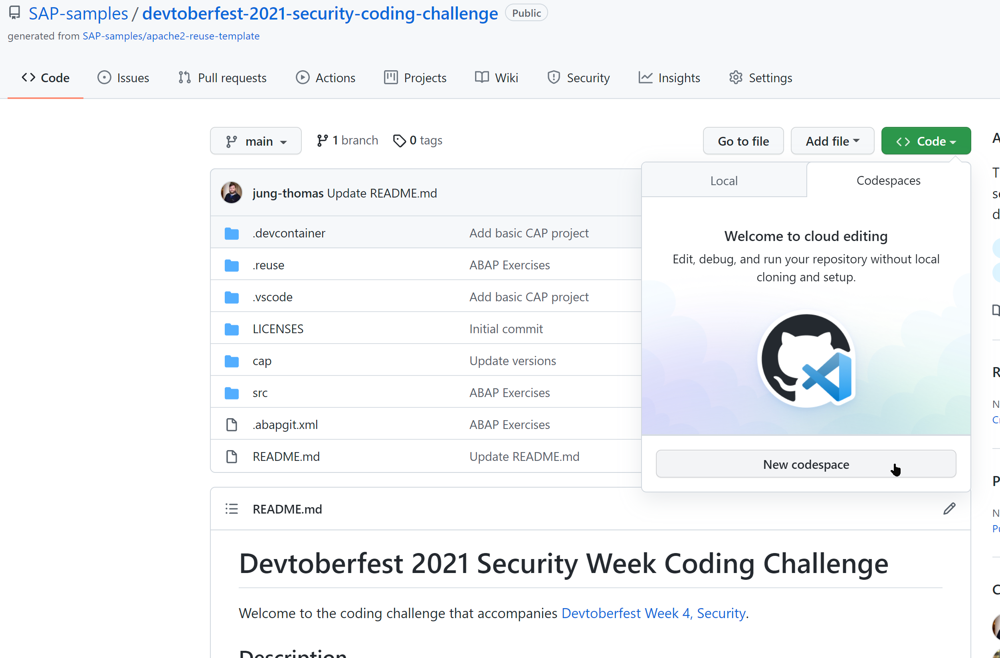

# Devtoberfest 2021 Security Week Coding Challenge

Welcome to the coding challenge that accompanies [Devtoberfest Week 4, Security](https://github.com/SAP-samples/devtoberfest-2021/blob/main/topics/Week4_Security/README.md).

## Description

To exapnd on the general security concepts of Devtoberfest Week 4, we also want to provide some practical exercises for both the ABAP and SAP Cloud Application Programming Model environment. You can choose to tackel the ABAP challenge, the CAP challenge or both of them.

### ABAP

All of the ABAP content is contained within the [/src](./src/) folder. We also have ABAPGit configuration within the root of this project. So you can clone this entire project and only the ABAP content should be brought into your system. The content has been tested on the SAP BTP, ABAP environment (Steampunk) trial, but it is generally enough that it could be used as starting templates for this challenge in recent release on premise systems as well with only some minor adjustments for the target data model.  Also each of challenge classes are relatively simple and self contained.  You could also just use the community ABAP tools extensions for Visual Studio Code and perform this code challenge locally (or via GitHub Codespaces) without access to a backend ABAP system.

This challenge consists of three ABAP classes all of which have typical security issues when working with dynamic SQL. Your challenge is to improve this code; keeping it still dynamic but improve the safety of the code. 

### SAP Cloud Application Programming Model

The rest of the content in this challenge is an SAP Cloud Application Programming Model project within the [/cap](./cap/) folder. This is an already built project with the basic sample data model. It can be cloned locally into VSCode or into the SAP Business Application Studio or you can edit it directly from GitHub Codespaces. It is configured to run with SQLite, so no backend HANA dependencies are necessarily needed to start.

This is a perfectly normal, although simple, CAP project. However it lacks certain security features that are available to the Cloud Application Programming Model. Your callenge is to add one or more of these features into the project. The more security features the better.  We will also have a live session [Security Aspects of SAP Cloud Application Programming Model](https://www.youtube.com/watch?v=jQYMeN3jeOU) on Wednesday, October 27th at 17:00 CEST / 23:00 SGT / 11:00 EDT [🌎](https://www.timeanddate.com/worldclock/converter.html?iso=20211027T150000&p1=37&p2=198&p3=438&p4=240&p5=tz_sgt) to discuss some of the security aspects you could add as part of this challenge.

- Add [CORS](https://developer.mozilla.org/de/docs/Web/HTTP/CORS) processing for when the CAP service is used directly without an Application Router
- [Add authentication to your CAP Service](https://cap.cloud.sap/docs/node.js/authentication) 
- [Add Access Control to your CAP Model/Service](https://cap.cloud.sap/docs/guides/authorization#restrictions)
- [Add Instance Based Authorization (Role Level Checks)](https://cap.cloud.sap/docs/guides/authorization#instance-based-auth)
- [Add A Content Security Policy](https://cap.cloud.sap/docs/node.js/best-practices#content-security-policy-csp)
- Other aspects - up to you

#### General Approach to the CAP Coding Challenge

The general process you must follow for this challenge is:

* set up [Microsoft VS Code](https://code.visualstudio.com/download) with the [CAP tools] (https://developers.sap.com/tutorials/cp-apm-nodejs-create-service.html) on your machine if you haven't got it already or gain access to the [SAP Business Application and a Full Stack Cloud Application Dev Space](https://developers.sap.com/tutorials/hana-cloud-cap-create-project.html)
* fork this repository and clone it into your choosen development environment
* Code your improvements, test, repeat
* submit a pull request (PR) with the exact title "WEEK4CHALLENGE" to this repository, containing the changes you made

> If you have access to [GitHub Codespaces](https://github.com/features/codespaces) then you can do all of this in the cloud, including the installation and use of all of the extensions.
> 

## Challenge Rules

We don't want to be too prescriptive in this fun challenge, but there are a few things that we need to ask you to do, so that things have a chance of running smoothly.

For this challenge, please abide by these rules:

1. You have a week to complete the challenge, i.e. to submit a Pull Request with your script changes.  This means that any PR submitted after Friday 29 Oct will not be considered.
1. Please ensure you specify the following precisely in the title of your Pull Request: `WEEK4CHALLENGE <your SAP Community user name>`. So if your SAP Community user name is e.g. `dj.adams.sap` (from https://people.sap.com/dj.adams.sap) then the title of your Pull Request must be `WEEK4CHALLENGE dj.adams.sap` (you can put whatever you want in the PR description - i.e. the multi-line text area).
1. You only need to send modifications to the content in the /src or /cap folders, you should not need to modify any other files in this repository.
1. We will not actually merge your Pull Request as the base repository remains the starting template for everyone. Instead we will just judge your submissions based upon what is contained within the Pull Request.

## How to obtain support

[Create an issue](https://github.com/SAP-samples/devtoberfest-2021/issues/new?assignees=jung-thomas&labels=week4-security&template=about-week-4--security--content.md&title=) in this repository if you find a bug or have questions about the content.
 
For additional support, [ask a question in SAP Community](https://answers.sap.com/questions/ask.html).

## Contributing

## License
Copyright (c) 2021 SAP SE or an SAP affiliate company. All rights reserved. This project is licensed under the Apache Software License, version 2.0 except as noted otherwise in the [LICENSE](LICENSES/Apache-2.0.txt) file.
